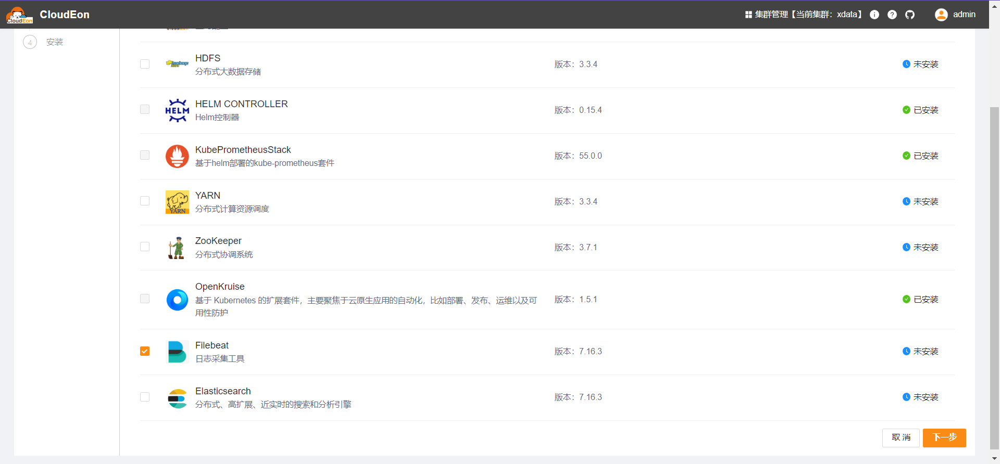
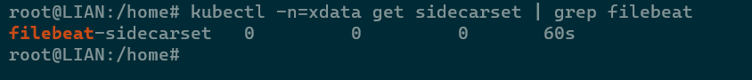

# Filebeat

## 组件说明

日志采集工具，是CloudEon组件日志分析功能的基础。部署此组件本身不产生新容器，但是其他组件会根据是否部署此组件决定是否启用filebeat日志采集。

## 安装步骤

### 选择服务

### 分配角色实例

由于此组件无实际部署动作，故无需且不能选择实例

### 修改初始化配置

一般不用调整

### 检测验证

等待安装成功，可以看到目标命名空间下已产生对应pod

